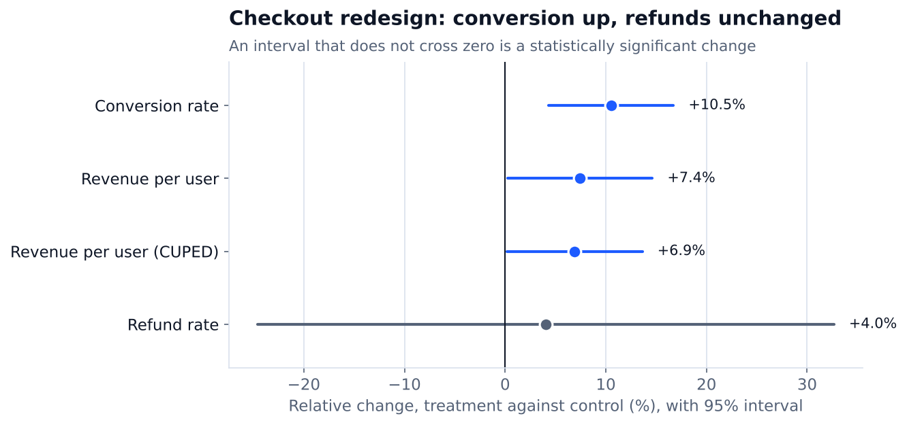
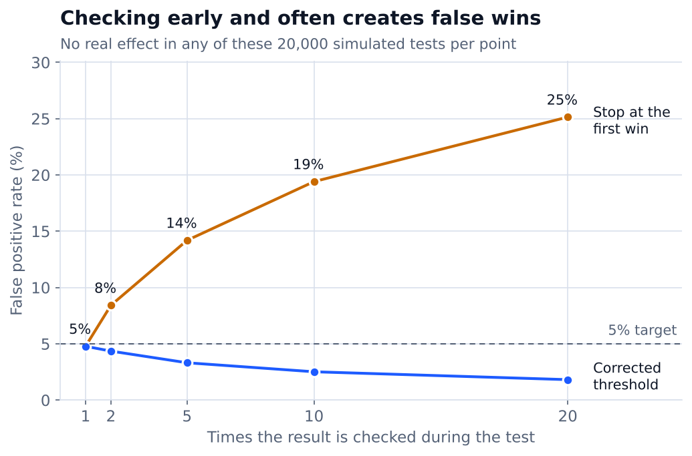
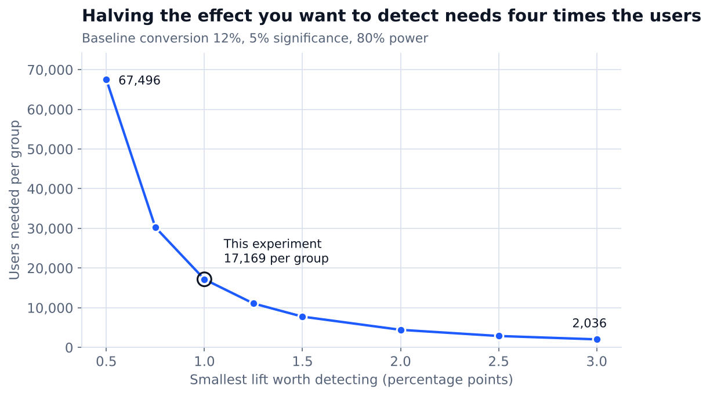

# A/B Testing Toolkit

[](https://github.com/AshokReddy010/ab-testing-toolkit/actions/workflows/ci.yml)

A small Python toolkit that takes an experiment from planning to a written decision: how many users the test needs, whether the data can be trusted, whether the change worked, and what to do about it.

It is built around the mistakes that most often make A/B test results wrong: stopping early, broken assignment, too many metrics, and noisy data. Each one has a check in the toolkit, and each check is verified against simulation.

## What it does

| Step | Question it answers | Module |
|:--|:--|:--|
| Plan | How many users do I need, and how many days will that take? | `abkit/power.py` |
| Health check | Did users split between the groups as designed? | `abkit/checks.py` |
| Analyse | Did the rate or the average change, and by how much? | `abkit/stats.py` |
| Reduce noise | Can pre-experiment data narrow the interval? (CUPED) | `abkit/cuped.py` |
| Correct | Am I testing so many metrics that one wins by luck? | `abkit/corrections.py` |
| Decide | Ship, do not ship, inconclusive, or do not trust? | `abkit/readout.py` |
| Verify | Do the formulas behave as statistics says they should? | `abkit/simulate.py` |

## Example: a checkout redesign

The example data is **simulated**, with a known true effect (conversion +1.0 point, refunds unchanged), so the analysis can be compared with the right answer.

**Planning.** With a 12% baseline, detecting a 1-point lift at 5% significance and 80% power needs **17,169 users per group**. At 2,500 eligible users a day that is a 14-day test.

**Result.** One command produces the [full readout](reports/checkout_experiment_readout.md):

> **Decision: Ship.** Conversion rose by +1.25% points (95% interval +0.55% to +1.95%), with no guardrail harmed.

| Metric | Control | Treatment | Difference | 95% interval | p-value |
|:--|:--|:--|:--|:--|--:|
| Conversion rate | 11.85% | 13.10% | +1.25 pts | +0.55 to +1.95 pts | 0.0005 |
| Revenue per user | 8.612 | 9.253 | +0.641 | +0.046 to +1.237 | 0.0346 |
| Refund rate | 0.58% | 0.60% | +0.02 pts | -0.14 to +0.19 pts | 0.7777 |



Three things worth noticing:

- **The interval contains the true effect.** The data was built with a +1.0 point lift, and the interval of +0.55 to +1.95 covers it. The point estimate of +1.25 is higher than the truth, which is normal sampling noise and a reminder not to quote a single number without its interval.
- **Revenue is not a confirmed win.** Its p-value is 0.035 on its own, but 0.069 after correcting for looking at more than one extra metric. The readout reports the corrected value so a secondary metric is not oversold.
- **CUPED helped a little.** Using each user's pre-experiment spending removed 11.1% of the variance in revenue per user and made the interval 5.7% narrower. The gain is modest here because most users buy nothing, so past spending explains only part of the outcome.

**A broken experiment.** The second example file loses 4% of treatment users before they are logged. The same command returns:

> **Decision: Do not trust.** Sample ratio mismatch: expected 50% of users in control, observed 51.05% (p = 0.00012).

A 51/49 split looks harmless, but with 33,632 users it is far outside what chance allows, and the toolkit refuses to read the metrics until it is explained.

## Does the toolkit give the right answers?

Each check below has a known correct value. [Simulating 20,000 experiments](reports/validation_results.md) per check gives:

| Check | Theory | Simulated |
|:--|--:|--:|
| False positive rate when there is no real effect | 5.0% | 4.85% |
| Power at the planned sample size and effect | 80.0% | 80.33% |
| 95% intervals that contain the true effect | 95.0% | 94.98% |

### Why you should not stop at the first significant result



With no real effect at all, checking a test 10 times and stopping at the first "win" calls a winner **19.4%** of the time instead of 5%. Checking 20 times raises that to 25.1%. Testing each look at a stricter threshold brings it back under 5% (2.5% at 10 looks), at the cost of being more conservative than necessary.

### Why small effects are expensive



Detecting a 0.5-point lift instead of a 1-point lift takes 67,496 users per group instead of 17,169. Halving the effect roughly quadruples the sample.

## Use it

```python
from abkit import sample_size_proportions, duration_days, proportion_test, srm_check

n = sample_size_proportions(baseline=0.12, mde=0.01)      # 17169 per group
duration_days(n, daily_users=2500)                         # 14 days

srm_check(n_control=17169, n_treatment=17169).passed       # True
result = proportion_test(2035, 17169, 2249, 17169)
result.abs_diff, result.ci_low, result.ci_high, result.p_value
```

For a whole experiment, one row per user with `group`, `converted`, `revenue`, `pre_revenue` and `refunded` columns:

```python
import pandas as pd
from abkit import analyse_experiment, render_readout

readout = analyse_experiment(pd.read_csv("data/checkout_experiment.csv"), name="Checkout redesign")
print(readout.decision)          # Ship
print(render_readout(readout))   # the full written readout
```

## Run it yourself

Needs Python 3.10 or newer. Commands are for Windows CMD.

```
git clone https://github.com/AshokReddy010/ab-testing-toolkit.git
cd ab-testing-toolkit
python -m venv .venv
.venv\Scripts\activate
pip install -r requirements.txt

pytest -q
python scripts\make_example_data.py
python scripts\run_readout.py
python scripts\validation_study.py
```

`pytest` runs 30 tests. They compare the formulas with textbook values and with SciPy, and check the decision rules on five scenarios: clear win, clear loss, no effect, guardrail harmed and broken assignment. GitHub Actions runs them on every push.

## Decision rules

The readout applies these in order, and stops at the first that matches:

1. Sample ratio mismatch fails (p < 0.001): **do not trust**.
2. A guardrail metric is significantly worse: **do not ship**.
3. The interval for the primary metric is entirely above zero: **ship**.
4. The interval is entirely below zero: **do not ship**.
5. Otherwise: **inconclusive**, with the smallest lift the test could have detected.

## Limitations

- The example data is simulated. It shows that the method works, not what a real checkout change would do.
- The peeking correction is the simple one (divide the threshold by the number of looks). It is safe but conservative; a group sequential design such as O'Brien-Fleming would give up less power.
- It handles two groups and per-user metrics. Ratio metrics such as revenue per session, and tests with several variants, would need the delta method and a multi-arm comparison.

## Tools

Python, NumPy, pandas, SciPy, Matplotlib, pytest, GitHub Actions.

## Author

Ashok Reddy Bhimavarapu · [Portfolio](https://ashokreddy010.github.io) · [LinkedIn](https://www.linkedin.com/in/ashokreddy1)
